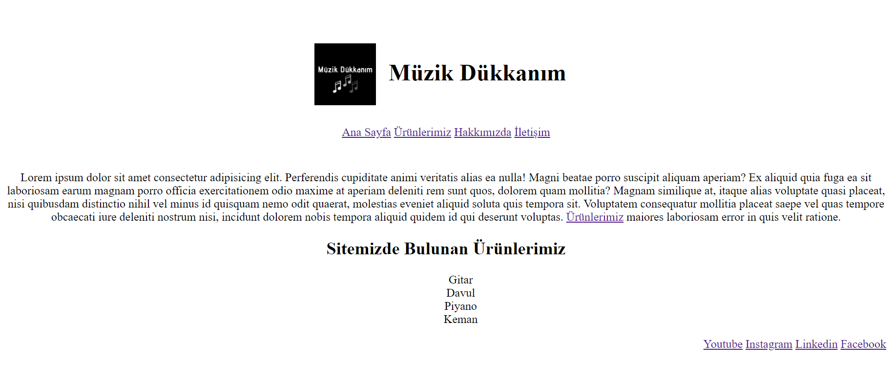
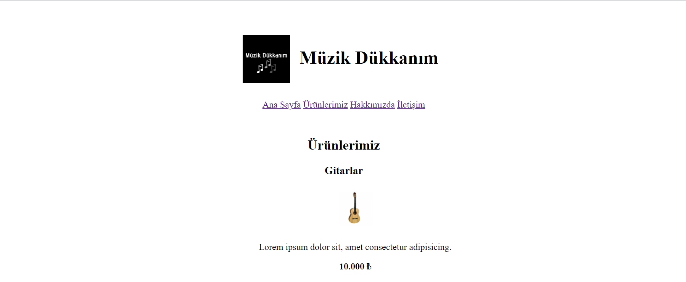
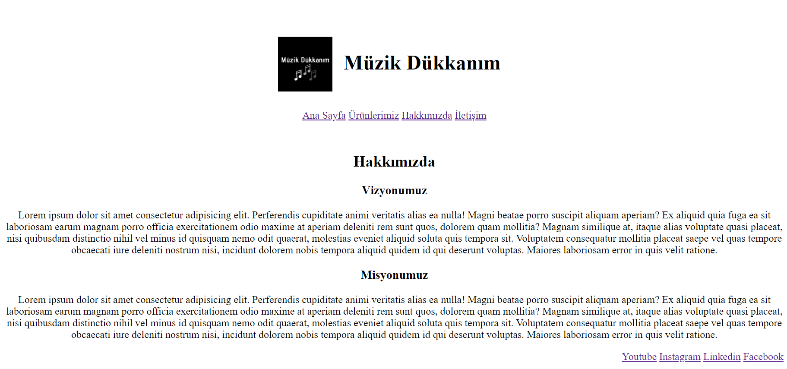
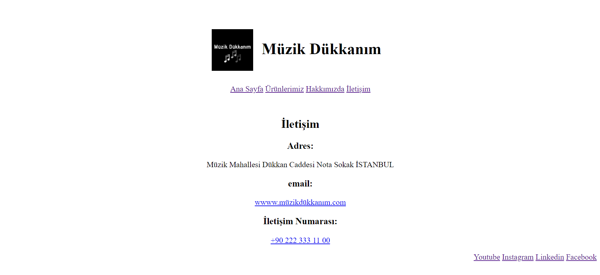

# CSS Ödev 1

## Müzik Dükkanım

Bu repo [Kodluyoruz](https://www.kodluyoruz.org/) Front-End Eğitim içeriğinin CSS konusunun ilk ödevidir. 

Proje içerik olarak;

REDAME.md

index.html 

contactus.html

aboutus.html

product.html

style.css ve

image dosyalarını barındırıyor.

## Ana Sayfa

## Ürünlerimiz

## Hakkımızda

## İletişim

  

# Installation

Öncelikle projeyi klonlayın. 

[https://github.com/elifzgnrl/css_odev_1](https://github.com/elifzgnrl/css_odev_1)
  
# Usage
Projeyi klonladıktan sonra Visual Studio Code programında açınız.

Linux için:

cd kodluyoruz-odev3

code .

# Contribution
Pull requestler kabul edilir. Büyük değişiklikler için, lütfen önce neyi değiştirmek istediğinizi tartışmak için bir konu açınız.

# License
[MIT](https://choosealicense.com/licenses/mit/)
